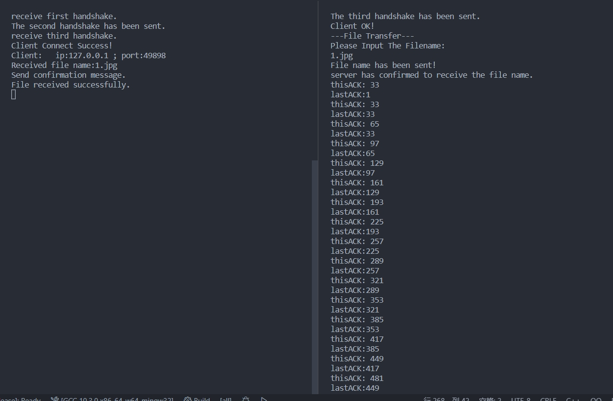
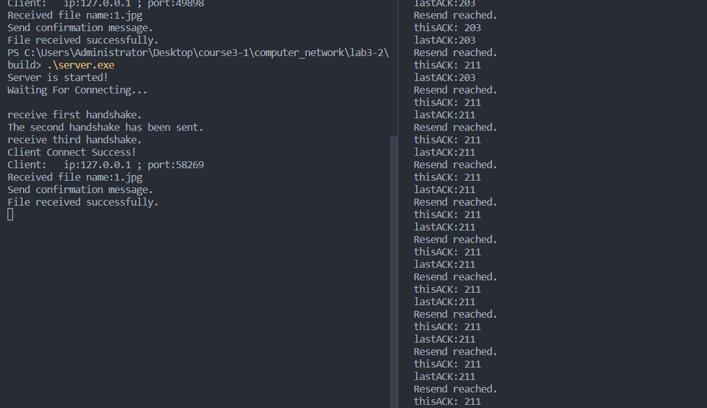

### LAB3：基于UDP服务的可靠传输协议

- 姓名：卢麒萱
- 学号：2010519
- 专业：计算机科学与技术

#### 实验要求

**3-2** 在实验3-1的基础上，将停等机制改成基于滑动窗口的流量控制机制，采用固定窗口大小，支持累积确认，完成给定测试文件的传输。

#### 协议设计

##### 数据包及其首部

本协议定义了两种数据包，分别为携带标志信息的数据包 `SignPackage `和携带文件的数据包 `DataPackage `。其中，携带标志信息的数据包 `SignPackage `中包含一个 `label `标志位和一个 `serialNumber `序列号。该类数据包主要用于三次握手过程以及 `Server `服务器端对于客户端的应答。 同时，预设了7个标志位，分别为第一次握手、第二次握手、第三次握手、文件名传输、文件传输、传 输出错、传输结束。携带文件的数据包。 `DataPackage `主要用于文件数据的传输。它包括一个`label`标志位、一个 `serialNumber `序列号、一个 `length `长度位、一个用于承装数据的 `char `型数组 `data` 以及 一个 `checkSum `校验和。

##### 建立连接过程

本协议模仿三次握手建立连接。具体流程为：客户端向服务器端发送一个 `SignPackage `数据包，其`label`为第一次握手；服务器端收到数据包后回发一个 `SignPackage` 数据包，其 `label` 为第二次握手；客户端收到数据包后再回发一个 `SignPackage` 数据包，其 `label` 为第三次握手。当服务器端收到第三个数据包是代表三次握手成功，连接建立。其中，当客户端超时未收到第二个数据包，会重发第一个数据包；当服务器端超时未收到第三个数据包，会重发第二个数据包。

##### 差错检测机制

本协议在传输文件，即发送 `DataPackage `数据包时采用差错检测机制。`DataPackage`数据包首部有一个 `checkSum` 校验和位，在客户端发送数据包之前，会为其添加包头，然后计算这个数据包的校验和，其具体方法为进行`16`位二进制反码求和运算，若有进位则加到末位，计算结果取反写入校验和域段，之后发送该数据包。服务器端在接受到数据包后按照同样的方法计算除校验和位外的其他所有数据的校验和，并将计算结果与数据包中的校验和位进行比较，看是否一致，若一致，则可认为传输未出错，反之则证明传输出错，应重传。

##### 确认重传机制

本协议在发送数据包的同时开启一个定时器，若是在一定时间内没有收到发送数据的 `ACK `确认数据包，则对该数据包进行重传，在达到一定次数（此处设置为`50`）还没有成功时放弃，退出程序并发送一个错误信号给对方，对方收到这个错误信号后也直接退出。

##### 基于滑动窗口的流量控制机制

本协议参照GO-BACK-N协议设计了一个滑动窗口，发送端发送文件后接收端不用每次都回复 ACK 确认消息，而是回复按序收到的序列号最大的序列号的值加一，代表接收端期望接收到却没有接收到的序列号。当发送端接收到这个序列号，滑动窗口就会滑动到这个序列号所在的位置，就会从这个序列号开始重新发送滑动窗口大小的个数的数据包。

#### 代码分析

任务二是在任务一的基础上完成，因此与任务一中同样的代码这里就不加赘述了，此处只展示与任务一中不同的代码。

##### 丢包控制

本次实验由于需要测试丢包后利用GO-BACK-N协议重传是否正确，定义了一个`mysendto`函数代替所有`sendto`函数，设置固定每500次传输有一次丢包，所有图片传输数据包个数都大于500，因此保证必然丢包。

```cpp
void mysendto(SOCKET s, const char* buf, int len, int flags, const sockaddr* to,
  int tolen) {
  static int i = 0;
  ++i;
  if (i >= 500) {
    i = 0;
    return;
  }
  sendto(s, buf, len, flags, to, tolen);
}
```

##### 服务器端

###### 宏定义

任务二的宏定义比任务一多了两个，分别是滑动窗口的大小，以及最大序列号。代码中将滑动窗口大小设置为32个数据包，将最大序列号设置为512。

```cpp
#define MAX_WINDOW 32//滑动窗口大小
#define MAX_SERIAL_NUM 512//最大序列号
```

###### 接收文件

此处设置了一个 `serialNum `表示当前期望接收到的序列号，其开始值为1。然后在一个循环里接收数据 包，每接收到一个数据包，判断它的标志位是否是 `SEND_DATA` ，它的校验和是否正确，判断它的序列 号是否是等于当前期望接收到的序列号（ `serialNum `），若是的话，则将其写入文件， `serialNum `加 一，继续接收下一个数据包。若收到的数据包的序列号小于期望接收到的序列号（ `serialNum `），则 将该数据包丢弃（因为它肯定已经被写入过文件了）。若收到的数据包的序列号大于期望接收到的序列 号（ `serialNum `），代表收到了一个乱序的包而期望收到的数据包没有收到，因此向发送端发送一个 序列号为 `serialNum `的数据包，告诉发送端这个序列号以前的都收到了，但这个序列号没有收到，请 从这个序列号开始重新发送。同时，若超过一定时间（这里设置为200ms）没有收到，则直接发送含有 当前 `serialNum `的数据包。当接收到一个标志位为 `SEND_FINISH `的数据包时，代表文件已经接收完。这时接收端向发送端发送一个标志位为 `SEND_FINISH `的数据包，代表接收端已经成功接收完文 件。

```cpp
//接收文件
int count = 0;
int serialNum = 1;
testNum = 0;
start = clock();
while (true) {
    memset(dataPackage.str, 0, sizeof(dataPackage.str));
    memset(signPackage.str, 0, sizeof(signPackage.str));
    ret = recvfrom(ClientSocket, dataPackage.str, sizeof(dataPackage.str), 0, (sockaddr*)& RemoteAddr, &nAddrLen);
    if (/*testNum > MAX_TEST_NUM || */dataPackage.pac.lable == SEND_ERROR) {
        signPackage.pac.lable = SEND_ERROR;
        sendto(ClientSocket, signPackage.str, sizeof(signPackage.str), 0, (sockaddr*)& RemoteAddr, nAddrLen);
        sendto(ClientSocket, signPackage.str, sizeof(signPackage.str), 0, (sockaddr*)& RemoteAddr, nAddrLen);
        sendto(ClientSocket, signPackage.str, sizeof(signPackage.str), 0, (sockaddr*)& RemoteAddr, nAddrLen);
        cout << "Transmission error, press any key to exit." << endl;
        //cout << testNum;
        system("pause");
        return -1;
    }
    //if (ret > 0) {
    if (dataPackage.pac.lable == SEND_DATA && dataPackage.pac.serialNumber == serialNum && checkSum(dataPackage)) {
        DataPackage writeDataPackage = dataPackage;
        ret = fwrite(writeDataPackage.pac.data, sizeof(char), writeDataPackage.pac.length, fp);//写文件
        serialNum = (serialNum == MAX_SERIAL_NUM) ? 1 : (serialNum + 1);//更改期望收到的序列号
        if (ret < writeDataPackage.pac.length) {//写入失败
            signPackage.pac.lable = SEND_ERROR;
            sendto(ClientSocket, signPackage.str, sizeof(signPackage.str), 0, (sockaddr*)& RemoteAddr, nAddrLen);
            sendto(ClientSocket, signPackage.str, sizeof(signPackage.str), 0, (sockaddr*)& RemoteAddr, nAddrLen);
            sendto(ClientSocket, signPackage.str, sizeof(signPackage.str), 0, (sockaddr*)& RemoteAddr, nAddrLen);
            cout << file_name << "Write failed, press any key to exit." << endl;
            system("pause");
            return -1;
        }
    }
    else if (dataPackage.pac.lable == SEND_FINISH && dataPackage.pac.serialNumber == serialNum && checkSum(dataPackage)) {//传输文件完成，返回确认消息
        signPackage.pac.lable = SEND_FINISH;
        sendto(ClientSocket, signPackage.str, sizeof(signPackage.str), 0, (sockaddr*)& RemoteAddr, nAddrLen);
        sendto(ClientSocket, signPackage.str, sizeof(signPackage.str), 0, (sockaddr*)& RemoteAddr, nAddrLen);
        sendto(ClientSocket, signPackage.str, sizeof(signPackage.str), 0, (sockaddr*)& RemoteAddr, nAddrLen);
        cout << "File received successfully.\n";
        break;
    }
    else if (clock() - start > MAX_DELAY_TIME || dataPackage.pac.serialNumber > serialNum || serialNum - dataPackage.pac.serialNumber > MAX_WINDOW) {//超时或失序发ack
        signPackage.pac.serialNumber = serialNum;
        signPackage.pac.lable = SEND_DATA;
        sendto(ClientSocket, signPackage.str, sizeof(signPackage.str), 0, (sockaddr*)& RemoteAddr, nAddrLen);
        testNum++;
        start = clock();
    }
}
```

##### 客户端

###### 发送文件

此处设置了一个 `serialNum `，代表序列号，一个 `lastACK `代表上次收到的 `ACK `，一个 `thisACK `代表本次收到的 `ACK `， `isReadDown` 代表是否读完文件， `isCompleted `代表文件是否发送完毕，`lastSerialNum `代表最后一个包的序列号。同时设置了一个 `map `类型的 `helper `保存序列号和缓冲区下标的映射关系。起始时从缓冲区的开头读入文件。然后在一个循环里，首先向缓冲区里读入文件。由于缓冲区我们需要循环使用，而从上次确认的序列号到本次确认的序列号之间的数据是已经确认接收到的，因此这部分缓冲区可以重新读入。我们通过 `helper` 中保存的映射关系来确定可以重新读入文件的缓冲区下标，然后就从上次的位置继续读文件，并且构造数据包存入缓冲区中。当文件读入到缓冲区中以后，就开始发送数据包。一次性发送缓冲区大小（32个）的数据包（发送到文件末尾除外）。然后就接收数据包，当接收到一个标志位为 `SEND_DATA `的数据包，里面有一个序列号，这个序列号就是接收端期望接收到而没有接收到的，因此需要把 `lastACK `改成 `thisACK `， `thisACK` 改成这个接收到的序列号，然后在下一次循环中从 `thisACK` 开始发送数据包。若文件读取完毕，则给接收端发送一个标志位为 `SEND_FINISH` 的数据包，当收到一个 `SEND_FINISH `标志的数据包时，代表接收端已经确认接收整个文件，这是就可以跳出循环了，继续发送下一个文件。

```cpp
//传送文件
int serialNum = 1;             //序列号
int lastACK = 1;               //上次收到的ACK
int thisACK = MAX_WINDOW + 1;  //本次收到的ACK
int board = MAX_WINDOW - 1;    //缓冲区界限
int length;                    //数据长度
bool isReadDone = 0;           //是否读完文件
bool isCompleted = 0;          //文件是否发送完毕
int lastSerialNum = -1;        //最后一个包的序列号

map<int, int> helper;  //map保存序列号和缓冲区下标的映射关系
helper[thisACK] = 0;
helper[lastACK] = 0;
for (;;) {  //在此收发
memset(dataPackage.str, 0x00, sizeof(dataPackage.str));
testNum = 0;
int nextPosition =
  helper[lastACK];  //下一次读出的数据包放到缓冲区哪一个位置
int temp = (helper[thisACK] > helper[lastACK]) ?
  (helper[thisACK] - helper[lastACK]) :
  (helper[thisACK] + MAX_WINDOW - helper[lastACK]);
for (int i = 0; !isReadDone && i < temp; ++i) {  //构建并缓存包
  memset(dataPackage.str, 0x00, sizeof(dataPackage.str));
  length = fread(dataPackage.pac.data, sizeof(char),
    sizeof(dataPackage.pac.data), fp);  //读文件
  dataPackage.pac.length = length;
  dataPackage.pac.lable = SEND_DATA;
  dataPackage.pac.serialNumber = serialNum;
  helper[serialNum] = nextPosition;
  checkSum(&dataPackage);  //构建包
  if (ferror(fp)) {        //读文件出错
    dataPackage.pac.lable = SEND_ERROR;
    rep3(mysendto(sclient, dataPackage.str, sizeof(dataPackage.str), 0,
      (sockaddr*) &sin, len));
    cout << "Transmission error." << endl;

    return -1;
  }
  if (length == 0) {  //文件已读完
    isReadDone = 1;
    lastSerialNum = serialNum;
    dataPackage.pac.lable = SEND_FINISH;
    checkSum(&dataPackage);
    memcpy(cacheBuffer[nextPosition].str, dataPackage.str,
      sizeof(dataPackage.str));  //缓存包
    break;
  }
  memcpy(cacheBuffer[nextPosition].str, dataPackage.str,
    sizeof(dataPackage.str));  //缓存包
  serialNum =
    (serialNum == MAX_SERIAL_NUM) ? 1 : (serialNum + 1);  //更新序列号
  nextPosition = (nextPosition == (MAX_WINDOW - 1)) ?
    0 :
    (nextPosition + 1);  //更新缓冲区中下一次接收位置
}

int nextSend = helper[thisACK];
for (int i = 0; i < MAX_WINDOW; ++i) {  //发送缓存区的包
  mysendto(sclient, cacheBuffer[nextSend].str, sizeof(DataPackage), 0,
    (sockaddr*) &sin, len);
  if (cacheBuffer[nextSend].pac.lable == SEND_FINISH) {  //最后一个包发送
    break;
  }
  nextSend = (nextSend == (MAX_WINDOW - 1)) ?
    0 :
    (nextSend + 1);  //缓冲区中下一次发送位置
}
start = clock();

for (;;) {  //接收
  memset(signPackage.str, 0, sizeof(signPackage.str));
  ret = recvfrom(sclient, signPackage.str, sizeof(signPackage.str), 0,
    (sockaddr*) &sin, &len);
  if (ret > 0 && signPackage.pac.lable == SEND_DATA /*&&
      signPackage.pac.serialNumber == serialNum*/) {  //接收ack成功

    lastACK = thisACK;
    thisACK = signPackage.pac.serialNumber;
    if (signPackage.pac.serialNumber != serialNum) {
      //重发（GO-BACK-N）
      cout << "Resend reached." << endl;
      int nextSend = helper[signPackage.pac.serialNumber];
      for (int i = 0; i < MAX_WINDOW; ++i) {  //发送缓存区的包
        mysendto(sclient, cacheBuffer[nextSend].str, sizeof(DataPackage), 0,
          (sockaddr*) &sin, len);
        if (cacheBuffer[nextSend].pac.lable ==
          SEND_FINISH) {  //最后一个包发送
          break;
        }
        nextSend = (nextSend == (MAX_WINDOW - 1)) ?
          0 :
          (nextSend + 1);  //缓冲区中下一次发送位置
      }
    }

    break;
  }
  if (lastSerialNum > 0 && ret > 0 &&
    signPackage.pac.lable == SEND_FINISH) {
    cout << "server has confirmed to receive the file." << endl;
    isCompleted = 1;
    break;
  }
  if (/*testNum > MAX_TEST_NUM || */ signPackage.pac.lable == SEND_ERROR) {
    cout << "Transmission error." << endl;
    dataPackage.pac.lable = SEND_ERROR;
    rep3(mysendto(sclient, dataPackage.str, sizeof(dataPackage.str), 0,
      (sockaddr*) &sin, len));
    // cout << testNum;

    return -1;
  }
  if (clock() - start > MAX_DELAY_TIME) {  //超时重传
    ++testNum;
    break;
  }
}
if (isCompleted) {  //文件传输完毕
  break;
}
```

#### 实验结果

同时启动服务器端与客户端程序，然后依次发送4个测试文件，可以发现服务器端正确接收到了这4个文件，通过观察文件大小以及文件内容，可以看到虽然有丢包重传发生，但未发生数据丢失。






