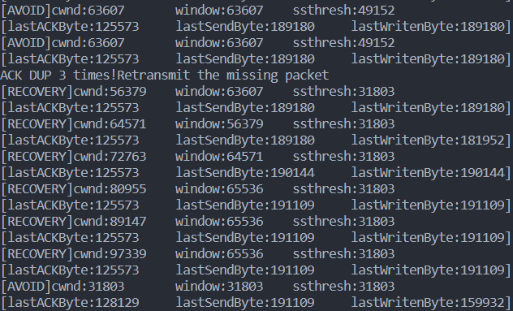

### LAB3：基于UDP服务的可靠传输协议

- 姓名：卢麒萱
- 学号：2010519
- 专业：计算机科学与技术

#### 实验要求

**3-3** 在实验3-2的基础上，选择实现一种拥塞控制算法，也可以是改进的算法，完成给定测试文件的传输。

#### 协议设计

##### 数据包及其首部

本协议定义了两种数据包，分别为携带标志信息的数据包头部 `PackageHead `和携带文件的数据包 `DataPackage `。其中，携带标志信息的数据包 `PackageHead  `中包含一个 `flag `标志位，一个 `seq `序列号，一个`ack`序列号，一个校验和`checkSum`，一个窗口大小`windows`，一个缓冲区大小`bufferSize`。该类数据包主要用于三次握手过程以及 `Server `服务器端对于客户端的应答。 同时，预设了4个标志位，分别为`SYN、ACK、FIN、END`。携带文件的数据包`DataPackage `主要用于文件数据的传输。它包括`PackageHead`数据包头和`data`装载数据。

##### 建立连接过程

本协议模仿三次握手建立连接。具体流程为：客户端向服务器端发送一个 `DataPackage `数据包，其`flag`为第一次握手`SYN`；服务器端收到数据包后回发一个 `DataPackage` 数据包，其 `flag` 为第二次握手`ACK&SYN`；客户端收到数据包后再回发一个 `DataPackage` 数据包，其 `flag` 为第三次握手`ACK`。当服务器端收到第三个数据包是代表三次握手成功，连接建立。其中，当客户端超时未收到第二个数据包，会重发第一个数据包；当服务器端超时未收到第三个数据包，会重发第二个数据包。

##### 断开连接过程

本协议模仿四次挥手断开连接。具体流程为：客户端向服务器端发送一个 `DataPackage `数据包，其`flag`为第一次挥手`FIN`；服务器端收到数据包后依次回发两个 `DataPackage` 数据包，其 `flag` 为第二次挥手`ACK`和第三次挥手`FIN`；客户端收到数据包后再回发一个 `DataPackage` 数据包，其 `flag` 为第四次挥手`ACK`。当服务器端收到第四个数据包是代表四次挥手成功，断开连接。其中，当客户端超时未收到第二个数据包，会重发第一个数据包。

##### 差错检测机制

本协议在传输文件，即发送 `DataPackage `数据包时采用差错检测机制。`PackageHead`有一个 `checkSum` 校验和位，在客户端发送数据包之前，会为其添加包头，然后计算这个数据包的校验和，其具体方法为进行`16`位二进制反码求和运算，若有进位则加到末位，计算结果取反写入校验和域段，之后发送该数据包。服务器端在接受到数据包后按照同样的方法计算除校验和位外的其他所有数据的校验和，并将计算结果与数据包中的校验和位进行比较，看是否一致，若一致，则可认为传输未出错，反之则证明传输出错，应重传。

##### 确认重传机制

本协议在发送数据包的同时开启一个定时器，若是在一定时间内没有收到发送数据的 `ACK `确认数据包，则对该数据包进行重传。

#### 拥塞控制算法

本协议设计了`RENO`拥塞控制算法，首先将拥塞窗口 `cwnd `设置为`MSS`，将阈值 `ssthresh `设置为`6MSS`。

##### 慢启动阶段：

- 接收端在每收到一次正确的`SEQ`时都向发送端发送它期望接收到的下一个序列号，即收到的序列号值加1。发送端收到正确的`ACK`，则窗口大小增大`1MSS`，即每过`1RTT`，`cwnd`翻倍。
- 重复收到三次`ACK`报文将进行丢失报文重传，并进入快速恢复阶段，通过`dupACKCount`记录收到同一报文的次数。
- `cwnd > sshthresh`后，进入拥塞避免阶段。
- 超时未收到新`ACK`，重新进入慢启动阶段。

##### 拥塞避免

- `cwnd `大小每当收到一个 `ACK` 增加，每经过一个 `RTT `只增加 1, 呈线性上升。
- 重复收到三次`ACK`报文将进行丢失报文重传，并进入快速恢复阶段。
- 超时未收到新`ACK`，说明拥塞严重，令`cwnd=1MSS,ssthreth=cwnd/2`，进入慢启动阶段。

##### 快速恢复

- 收到冗余`ACK`，`cwnd += 1MSS`。
- 收到新`ACK`，`cwnd=ssthresh`，窗口大小恢复为阈值，进入拥塞避免阶段。
- 超时没有收到`ACK`，说明拥塞严重，令`cwnd=1MSS,ssthreth=cwnd/2`，进入慢启动阶段。

#### 代码分析

任务二是在任务一的基础上完成，因此与任务一中同样的代码这里就不加赘述了，此处只展示与任务一中不同的代码。

##### 丢包控制

本次实验由于需要测试丢包后利用`RENO`拥塞控制是否正确，使用路由器程序进行丢包控制，由于转包最大包大小为 15000 字节，不能完整转发测试文件，仅用于观察窗口变化。


##### 客户端

本次实验在3-2的基础上进行了全面代码结构优化，使客户端主线程只负责发送窗口内数据，而新开一个线程负责处理接受应答报文并负责窗口滑动。而相较于上次实验，拥塞控制算法的改动主要在客户端的双线程中进行。

**滑动窗口：**以` DataPackage sendPkt[windowSize] `定义该滑动窗口内的缓冲区，每当发送新的数据包就保存到数组中，当收到 `ACK` 报文，窗口向前滑动即将在数组靠后的值赋给前面的值。当超时重传，将数组中全部数据包重传一次。` base、nextSeqNum、windowSize` 维护了当前的滑动窗口状态，` [base,nextSeqNum] `之间是已发送但未被确认的数据包，` [nextSeqNum,base+windowSize] `是滑动窗口中未使用的缓存空间。

**处理 `ACK `报文的线程实现方法：**该线程始终在调用 `recvfrom `函数等待报文到达，并判断`ACK`值是否在窗口内，若是则将序列号`base`更新为`recvPackage.head.ack+1`，并更新缓冲区，但在更新中必须对共享变量加锁，防止多线程间数据冲突。

如果窗口在滑动后没有正在等待被确认的报文了，就关闭计时器；否则，计时器更新重新启动。如果 `(base == packageNum) `为真，意味着数据已经全部传输完毕了，该线程函数以及退出，否则在后续断开连接时会影响程序正常运行。

###### 处理应答报文的线程

通过变量`RENO_STAGE`记录当前所处的阶段。当接受到的报文无误，且是新的`ACK`报文，则首先进行窗口滑动，再根据目前阶段进行相应处理。

```cpp
if (CheckSum((u_short *) &recvPacket, sizeof(DataPackage)) == 0 && recvPacket.head.flag & ACK) {
    if (base < (recvPacket.head.ack + 1)) {
        int d = recvPacket.head.ack + 1 - base;
        for (int i = 0; i < d; i++) {
            lastAckByte += sendPkts[i].head.bufferSize;
        }
        for (int i = 0; i < (int) waitingNum(nextSeqNum) - d; i++) {
            sendPkts[i] = sendPkts[i + d];
        }
        string stageName;
        switch (RENO_STAGE) {
            case START_UP:
                cwnd += d * MSS;
                dupACKCount = 0;
                if (cwnd >= ssthresh)
                    RENO_STAGE = AVOID;
                break;
            case AVOID:
                cwnd += d * MSS * MSS / cwnd;
                dupACKCount = 0;
                break;
            case RECOVERY:
                cwnd = ssthresh;
                dupACKCount = 0;
                RENO_STAGE = AVOID;
                break;
        }
        window = min(cwnd, windowSize);
        base = (recvPacket.head.ack + 1) % MAX_SEQ;
        stageName = getRENOStageName(RENO_STAGE);
    }
```

若收到冗余`ACK`报文，则将记录冗余`ACK`数目的`dupACKCount++`。若此时处于慢启动和拥塞避免阶段则重传报文且进入快速恢复阶段，若处于快速恢复阶段，则窗口增大`cwnd+=MSS`。

```cpp
else {
    dupACKCount++;
    if (RENO_STAGE == START_UP || RENO_STAGE == AVOID) {
        if (dupACKCount == 3) {
            ssthresh = cwnd / 2;
            cwnd = ssthresh + 3 * MSS;
            RENO_STAGE = RECOVERY;
            fastResend = true;
        }
    } else {
        cwnd += MSS;
    }

    string stageName = getRENOStageName(RENO_STAGE);
}
```

###### 发送线程

首先判断是否需要重发缓冲区。若正常发送，则先计算每次发送的数据段长度`Datalen=min(MSS，窗口剩余大小，文件剩余大小)`，保存至滑窗缓冲区中。若窗口超时，会将缓冲区中所有内容重传，进入慢启动阶段。

```cpp
void sendHandler(u_long len, char *fileBuffer, SOCKET &socket, SOCKADDR_IN &addr) {

    int Datalen;

    char *data_buffer = new char[sizeof(DataPackage)], *pkt_buffer = new char[sizeof(DataPackage)];
    nextSeqNum = base;
    cout << "filelen: " << len << "Bytes" << endl;

    int sumPackets = 0, lossPackets = 0;
    auto nBeginTime = chrono::system_clock::now();
    auto nEndTime = nBeginTime;
    HANDLE recvhandler = CreateThread(nullptr, 0, recvHandler, LPVOID(&socket), 0, nullptr);
    HANDLE timeouthandler = CreateThread(nullptr, 0, timeoutHandler, nullptr, 0, nullptr);
    string stageName;
    while (true) {
        if (lastAckByte == len) {
            nEndTime = chrono::system_clock::now();
            auto duration = chrono::duration_cast<chrono::microseconds>(nEndTime - nBeginTime);
            double lossRate = double(lossPackets) / sumPackets;
            printf("System use %lf s, and the rate of loss packet is %lf\n",
                   double(duration.count()) * chrono::microseconds::period::num /
                   chrono::microseconds::period::den, lossRate);

            CloseHandle(recvhandler);
            CloseHandle(timeouthandler);
            PackageHead endPacket;
            endPacket.flag |= END;
            endPacket.checkSum = CheckSum((u_short *) &endPacket, sizeof(PackageHead));
            memcpy(pkt_buffer, &endPacket, sizeof(PackageHead));
            sendto(socket, pkt_buffer, sizeof(PackageHead), 0, (SOCKADDR *) &addr, nAddrLen);

            while (recvfrom(socket, pkt_buffer, sizeof(PackageHead), 0, (SOCKADDR *) &addr, &nAddrLen) <= 0) {
                if (clock() - start >= MAX_TIME) {
                    start = clock();
                    goto resend;
                }
            }

            if (((PackageHead *) (pkt_buffer))->flag & ACK &&
                CheckSum((u_short *) pkt_buffer, sizeof(PackageHead)) == 0) {
                cout << "finish file transfering." << endl;
                return;
            }

            resend:
            continue;
        }

        if (fastResend || timeOutResend)
            goto GBN;

        mutexLock.lock();
        window = min(cwnd, windowSize);
        if ((lastSendByte < lastAckByte + window) && (lastSendByte < len)) {
            sumPackets++;

            Datalen = min(lastAckByte + window - lastSendByte, MSS);
            Datalen = min(Datalen, len - lastSendByte);
            memcpy(data_buffer, fileBuffer + lastSendByte, Datalen);

            sendPkts[nextSeqNum - base] = creatPackage(nextSeqNum, data_buffer, Datalen);
            memcpy(pkt_buffer, &sendPkts[nextSeqNum - base], sizeof(DataPackage));

            sendto(socket, pkt_buffer, sizeof(DataPackage), 0, (SOCKADDR *) &addr, nAddrLen);

            if (base == nextSeqNum) {
                start = clock();
                stopTimer = false;
            }
            nextSeqNum = (nextSeqNum + 1) % MAX_SEQ;
            lastSendByte += Datalen;
        }
        mutexLock.unlock();
        continue;

        GBN:
        mutexLock.lock();
        for (int i = 0; i < nextSeqNum - base; i++) {
            memcpy(pkt_buffer, &sendPkts[i], sizeof(DataPackage));
            sendto(socket, pkt_buffer, sizeof(DataPackage), 0, (SOCKADDR *) &addr, nAddrLen);
        }
        if (timeOutResend) {
            ssthresh = cwnd / 2;
            cwnd = MSS;
            dupACKCount = 0;
            RENO_STAGE = START_UP;
        }
        timeOutResend = fastResend = false;
        mutexLock.unlock();
        start = clock();
        stopTimer = false;
    }
}
```

#### 实验结果

##### 路由器程序丢包观察

- 慢启动阶段，`cwnd`增大至`>=ssthresh`后进入拥塞避免阶段。

  

- 拥塞避免阶段相较于慢启动阶段`cwnd`增速减缓。

  

- 当重复收到三个`ACK`后开始快速重传，进入快速恢复阶段。每收到冗余的`ACK`后`cwnd+=MSS`，收到新`ACK`后，进入拥塞避免阶段。

  

- 服务器端输出也可看出，17号报文丢包，所以始终等候17号报文，将其他收到的错序报文丢弃，而客户端会在收到三次`ACK=16`后进入快速恢复阶段，重传17号报文，服务器端应答`ACK=17`后，客户端恢复到拥塞避免阶段。

  

##### 正常发送

发送文件成功后，程序通过四次挥手自动断开连接。

###### 服务器端


###### 客户端


###### 接收文件


验证了传输可靠性。