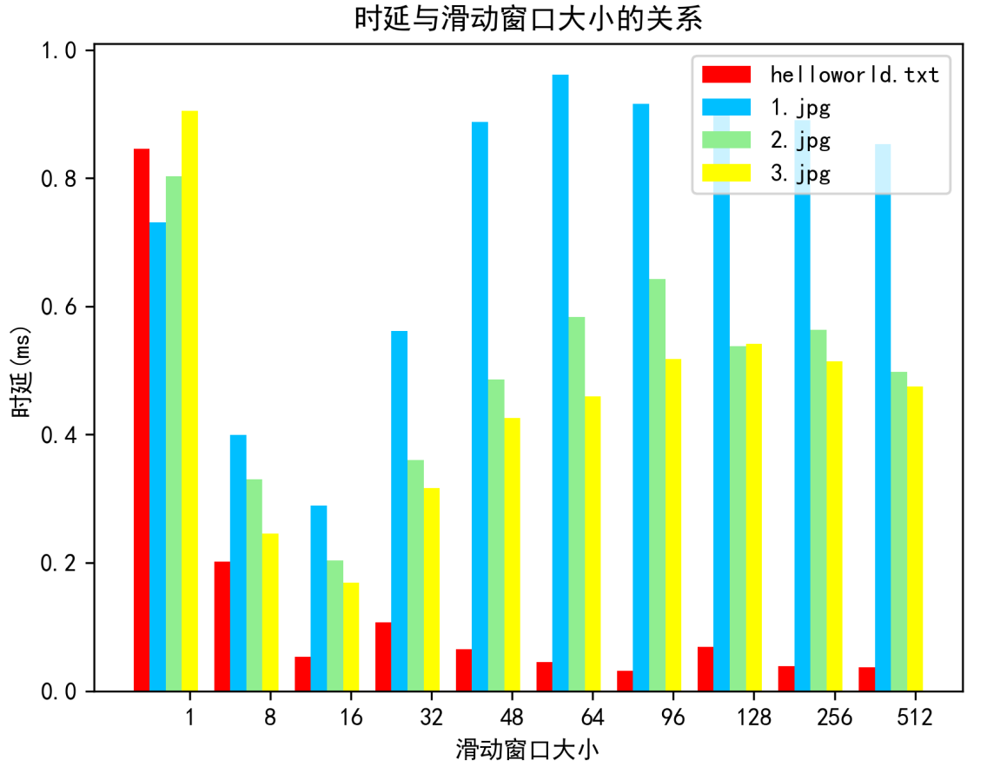

### LAB3：基于UDP服务的可靠传输协议

- 姓名：卢麒萱
- 学号：2010519
- 专业：计算机科学与技术

#### 实验内容

**3-4** 基于给定的实验测试环境，通过改变延迟时间和丢包率，完成下面3组性能对比实验：

1. 停等机制与滑动窗口机制性能对比；
2. 滑动窗口机制中不同窗口大小对性能的影响；
3. 有拥塞控制和无拥塞控制的性能比较。

#### 实验指标

##### 时延

时延是指一个报文或分组从一个网络的一端传送到另一个端所需要的时间。它包括了发送时延，传播时延，处理时延，排队时延。在本次实验中，我计算的是一个数据包从发送端发送到服务器端接收所用的平均时间。具体做法为在数据包头部加了一个字段用于记录数据包在发送端发送时的时间戳，在每次发送数据包之前给该字段附上当前的时间戳，当接收端收到该数据包时也记录当前的时间戳，减去数据包头部的时间戳获得了该数据包的时延。然后对于每个正确接收到的数据包将它们的时延累加，最后除以累计了时延的数据包个数，这样就可以得到一个平均时延，并将其作为我们性能对比实验的指标，其单位为ms。

##### 吞吐率

吞吐率指的是单位时间内通过某通信信道或某个节点成功交付数据的平均速率。在本次实验中，我计算的是发送端从开始从磁盘中读取文件第一个字节到收到接收端发来的确认接收数据包之间的时间作为文件的传输时间，然后用文件大小除以这个文件传输时间，得到传送这个文件的吞吐率，并将其作为我们性能对比实验的指标，其单位为Mb/s。 

由于我认为吞吐率可以看做宏观上发送文件的性能，因此把读写文件即IO的时间、封装数据包的时间、加入缓冲区的时间等一系列时间也算在内；而时延可以看做微观上一个数据包从第一个比特开始传输到最后一个比特接收到所用的时间，因此它不包括IO操作等用时，只是单纯地计算数据包在网络中驻留的时间长短。

#### 实验结果及分析

##### 停等机制与滑动窗口性能对比

###### 时延比较

由于滑动窗口的大小不同，因此将停等机制协议与不同滑动窗口大小的协议都进行比较。分别使用4份文件测试了实验3-1和实验3-2的代码，测得每次发送文件的时延，记录如下。

首先在宏观上可以看到停等机制的发送时延比各个滑动窗口大小的滑动窗口机制的发送时延都要小。其次可以看到当滑动窗口增大到一定程度时helloworld.txt文件发送的时延趋近于停等机制的时延。

首先分析为什么滑动窗口机制的时延比停等机制的时延普遍要高。我认为，在本次性能对比实验中，时延指的是数据包从发送端到接收端传输所用的时间。而停等机制是发送端发送一个数据包，在得到接收端的确认ACK之前不会发送下一个数据包。正是因为这样的机制，所以每个数据包发送的时候都不需要等待，直接就能够发送。相反，采用滑动窗口机制后，每次发送数据包时都是一次性发送滑动窗口大小个数的数据包，它们都有可能在发送端口处排队发送，因此导致时延变大。同时，由于接收端没有缓存数据包机制，每次接收到失序数据包都直接返回ACK，导致发送端需要从这个序列号开始重新发送，造成部分数据包重复发送，使网络拥堵，从而降低时延。

其次，老师上课时曾说过当滑动窗口大小等于1时，滑动窗口机制退化为停等机制。但是通过实验结果可以看到，此时的效率不如停等机制。猜测原因可能是时滑动窗口所用的算法逻辑更加复杂，导致电脑运行状态发生变化，使得发送数据包的性能变低。同时，由于我实现的滑动窗口算法中需要先将数据从文件中读取到缓冲区中，然后再从缓冲区中取出数据包并发送，这样“一存一取”就会导致增加大量的时间，这也是一个很重要的因素。

###### 吞吐率比较

由于滑动窗口的大小不同，因此将停等机制协议与不同滑动窗口大小的协议都进行比较。分别使用4份文件测试了实验3-1和实验3-2的代码，测得每次发送文件的吞吐率，记录如下。

从吞吐率的实验结果我们可以进一步遗憾地看出，停等机制的吞吐率竟然比滑动窗口机制的高得多，大概在16倍左右。基于反复测量结果均如此的事实，我不得不思考这背后的原因。首先从我们吞吐率的计算方式上来看，正如上文所述，我们计算的吞吐率是宏观上发送一个文件的效率的标志，它是将IO访问时间、数据包封装时间、排队时间等一系列时间全然考虑在内的一个总时间。因此回到我们的代码本身，滑动窗口机制实现的算法要比停等机制复杂得多：停等机制不需要数据缓冲区，它在从文件中读入数据之后就直接将其发送出去，滑动窗口机制则需要先将读取数据并构造数据包放入缓冲区中，然后再从缓冲区中取出数据包并发送。这样“一存一取”就会造成时间的增加。我认为这是最主要的因素。同时，停等机制的序列号只有0和1，但是滑动窗口机制的序列号为从1到512；停等机制不需要一些多余的标志位，但是滑动窗口机制设置了上次接收到的ACK、本次接收到的ACK、是否读完文件、文件是否发送完毕等等一系列的标志位，在算法实现的过程中通过这些标志位的修改与判断辅助我们实现滑动窗口机制的逻辑。此外，由于本次数据包的发送都是在一台电脑上，因此导致文件传输时间大大减少，如果是在不同的电脑尤其是相隔较远的地理位置时，可能时延会大大增加，相应的，滑动窗口机制的优越性也可能会得以凸显。因此，以上种种原因造成了停等机制的吞吐率要远高于滑动窗口机制吞吐率的局面。在后期，我会继续优化滑动窗口机制的代码，使其可以达到它在我们心目中应有的“高性能”。

##### 滑动窗口机制中不同窗口大小对性能的影响

###### 时延与滑动窗口大小

由于本次实验是探寻滑动窗口机制中不同窗口大小对性能的影响，因此基于实验3-2的代码，分别设置滑动窗口的大小为`1,8,16,32,48,64,96,128,256,512`，测得每次发送文件的时延，记录如下。

通过实验结果可以看出，当滑动窗口大小为1时，发送四个文件的时延都非常的高。然后当滑动窗口的大小不为1时，可以看到helloworld.txt的时延普遍比较低。然后后三个图形文件，它们都有着时延先增大再减小的趋势。首先我们可以看到文本文件和图片文件的时延是有一定区别的。helloworld.txt和1.jpg的大小差不多，而发送的时延区别却很明显，可以推断出文本文件发送的时延普遍比较短。推测是因为图片文件的格式问题，因为图片文件在发送的过程中首先需要按照它的编码方式进行相应的解码或者编码变成二进制数据流才进行发送。然后我们可以看到，当滑动窗口增大时，时延首先都有一个增加的趋势。由于在滑动窗口机制实现的过程中，我们一次性发送滑动窗口大小个数据包。这些数据包几乎同时完成发送。因此，当滑动窗口越大，同时发送的数据包的个数越多，造成了网络中的数据包拥堵的现象，进而导致了时延的增加。而对于当滑动窗口特别大，例如256或者512的时候，可能一个文件不需要这么多数据包便可以全部发送，因此，时延反而会有略微的下降。

###### 吞吐率与滑动窗口大小

由于本次实验是探寻滑动窗口机制中不同窗口大小对性能的影响，因此基于实验3-2的代码，分别设置滑动窗口的大小为`1,8,16,32,48,64,96,128,256,512`，测得每次发送文件的吞吐率，记录如下

从实验结果可以看到，首先，文件的大小越大，吞吐率越大；其次，滑动窗口的大小越大，吞吐率越大。在这次实验中，我们可以看到几乎没有例外的情况。由于吞吐率是由文件大小除以传输时间来计算的。每一次传送文件的大小不会变化，因此吞吐率增加意味着文件的传输时间减少。而滑动窗口越大，代表一次可以发送出去的数据包个数越多，同时每次从缓冲区中读取数据并构造数据包的个数会增加，每进行一次这样的操作的个数会减少，造成从文件中读取数据并装成数据包发送到网络中的速度变高，从而导致文件传输时间减少、吞吐率增加。可以看到实验的结果是符合我们的预期的。但同时我们也应意识到滑动窗口的大小并不是越大越好。因为假设存在丢包的情况，接收端每次收到一次失序的数据包都会返回一个ACK，当发送端收到这样的失序ACK时，便会从这个ACK开始重新发送滑动窗口大小个数的数据包，如果滑动窗口的大小过大会导致重复发送的数据包过多，进而也会导致吞吐率的下降。我们可以通过反复的实验来探寻最佳的滑动窗口的大小。

###### 总结

总的来说，滑动窗口的大小越大，其传送文件的性能就越好，因为一次可以发送文件的数目增加，减少了反复读文件、缓存数据包的时间，但是滑动窗口大小也并不是越大越好，考虑到丢包的情况会比较影响滑动窗口较大的机制的性能，因此，找到一个折中且适宜的滑动窗口大小显得尤为重要。

##### 有拥塞控制和无拥塞控制的性能比较

###### 时延与丢包率

分别基于3-2和3-3的代码，加上路由器的丢包设置，分别进行拥塞控制与非拥塞控制中时延与丢包率关系的探索。

通过改变路由程序中的丢包率，分别为`0，1%，2%，4%，5%，10%，20%，30%和50%`，分别测试在这九种情况下，发送文件的时延。可以看到在拥塞控制机制以及非拥塞控制机制中，随着丢包率的增加，时延都呈一个上升的趋势。考虑其原因，随着路由程序中丢包率的增加，有很多数据包在传输过程中得不到路由器的转发，接收端收不到该数据包就会向发送端发送代表错误的ACK信息，使发送端重新发送那些未正确接收的数据包。丢包率越大，需要重新发送的数据包就越多，发送端发送的数据包就越多，导致网络中的数据包越多，造成了网络拥堵的情况，使时延增加。同时，由于重新发送的数据包变多，在发送端口排队的数据包也会变多，这也是导致时延增加的一个因素之一。总之，这里的实验结果是符合我们预期的。

###### 吞吐率与丢包率

分别基于3-2和3-3的代码，加上路由器的丢包设置，分别进行拥塞控制与非拥塞控制中吞吐率与丢包率关系的探索。

从实验结果我们可以看出，随着丢包率的增加，吞吐率是越来越小的。丢包率为零，即不丢包时，吞吐率非常的高，然而一旦进行丢包，吞吐率就快速地下降。因为我们可以把不丢包的情况看做成“顺风顺水”的一种情况，在这种情况下发送端畅通无阻地按顺序发送所有的文件，因此文件发送的吞吐率非常的高。但是一旦发生了丢包的情况，接收端会告诉发送端哪个数据包丢失，发送端不得不重传该数据包。在3-2的代码中，由于接收端没有缓冲机制，发送端必须从该序列号开始一直往后发送，即使有些数据包已经发送。在3-3的代码中，发送端只需要重发这一个数据包即可，但即便如此，一旦发生丢包，发送端的发送状态会被打断，造成吞吐率大幅的下降。而随着丢包率的增加，发送端被打断的次数就会越多，导致吞吐率不断的降低。此处的实验结果也是符合我们预期的。

###### 时延与延时

分别基于3-2和3-3的代码，加上路由器的延时设置，分别进行拥塞控制与非拥塞控制中时延与延时关系的探索。

从实验结果可以看出，随着延时的增加，发送文件的时延也在增加。当路由器的延时为零时，发送文件的时延非常的低，然后通过绘制的图形界面可以看出，发送文件的时延的增加与路由器转发数据包延时的增加大概是成正比关系的。由于我们计算的时延是从发送端发出到接收端接收到一个数据包所用的时间，加上路由器之后，就会增加路由器转发的时间。在这里我们设置路由器转发的延时，当我们设置的这个路由器转发的延时相比于发送文件本身的时间来说特别大的时候，我们所计算得到的时延很大程度上就取决于路由器的延时时间。路由器的延时时间越大，我们计算得到的时延也就越高。这里的实验结果符合我们的预期。

###### 吞吐率与延时

分别基于3-2和3-3的代码，加上路由器的延时设置，分别进行拥塞控制与非拥塞控制中吞吐率与延时关系的探索。

从实验结果可以看出，随着延时时间的增加，吞吐率的大小不断的减小，当路由器转发数据包的延时时间为零时，吞吐率非常的高，而路由器转发的延时一旦不为零，吞吐率先是急剧的下降，然后呈现一个缓慢下降的趋势。首先当延时为零时，发送端可以畅通无阻地进行数据包的发送，路由器也畅通无阻地进行数据包的转发。此时发送文件的吞吐率最高，然而随着路由器转发数据包延时时间的增加，首先会导致单个数据包在发送的过程中变慢，进而导致整个文件发送的时间变长，从而导致吞吐率的下降。从另一个角度来看，时间增大到一定程度时，由于接收端久久收不到发送端发送的数据包，因此没有办法很快地给发送端回复确认收到的ACK数据包。当发送端检测到已经发送的数据包超时会重新发送数据包，从而造成了很多重复数据包的发送，导致了文件传输时间大大增加，吞吐率大大下降。基于以上的两个因素，可以看到延时时间越大，吞吐率越低，这符合我们的预期。

###### 拥塞控制与非拥塞控制中时延与丢包率

以2.jpg为例，分别测试了其在3-2和3-3的代码中发送时，时延与丢包率的关系，并将两个结果进行对比，如下图所示。

从实验结果可以看出，在不同丢包率的情况下，拥塞窗口机制与非拥塞窗口机制的时延大小差不多，但是拥塞窗口的时延比非拥塞窗口的时延略高。分析其原因，首先，时延高意味着数据包在从发送端离开到到达接收端之间滞留在网络中的时间越长，非拥塞窗口机制中的滑动窗口大小我们固定为32，意味着一次性可以发送32个数据包。而拥塞窗口机制中拥塞窗口的大小是不固定的，这就意味着一次性向网络中发送的数据包的个数是不确定的。通过打印出每一次发送过程中的cwnd，我们可以看出，在丢包率为零的情况下，拥塞窗口的cwnd一直在增加，它的平均值是远大于滑动窗口的大小32的。而在有丢包的情况下，cwnd的值即使会减少也是在1/2阈值的基础上进行增加。因此可以看到，普遍来说，拥塞窗口机制中，拥塞窗口的大小的平均值是要高于滑动窗口大小的，这就导致了拥塞窗口机制中一次性往网络中发送的数据包的个数平均来说是要大于滑动窗口的，因此数据包在发送的过程中，在发送端口排队的时间增加，网络中数据包的个数也会增加，造成了时延的增加。当然，随着丢包率的不断变化，拥塞窗口的大小也在不断的变化。这也导致了拥塞窗口机制中一次性发送数据报个数的不稳定性。不过总体来说，拥塞机制与非拥塞机制时延相差不大，但是丢包率为0时拥塞窗口的时延会更大，其他丢包率情况下拥塞窗口的时延稍大一丢丢。

###### 拥塞控制与非拥塞控制中吞吐率与丢包率

以2.jpg为例，分别测试了其在3-2和3-3的代码中发送时，吞吐率与丢包率的关系，并将两个结果进行对比，如下图所示。

从实验结果中我们可以看出，当丢包率为零时，拥塞窗口机制的吞吐率是明显高于非拥塞窗口的吞吐率的，当丢包率增加时它们的吞吐率都急剧的下降，但是拥塞窗口的吞吐率仍然略高于非拥塞窗口的吞吐率。当丢包率为零时，由于非拥塞窗口机制中滑动窗口的大小为32，这意味着我们每次同时发送32个数据包。而拥塞窗口中一次性同时发送数据包的个数取决于拥塞窗口的大小，如果丢包率为零，表示发送端可以一直畅通无阻的发送文件，不会因为收到失序的ACK而触发cwnd与阈值的惩罚机制，这样就导致cwnd一直在增加。对于这次传送的文件而言，通过打印出拥塞窗口的大小可以看到最大的拥塞窗口大小已经接近200，而且其大部分时候的拥塞窗口都是大于滑动窗口大小32的，这就意味着一次性发送的数据包的个数更多，从而从文件中读取并构造数据包到缓冲区中，再从缓冲区发送数据包这样的一个流程的次数会减少，节约了一部分开销，因此导致了吞吐率的明显的增加。而一旦产生了丢包的情况，即使是1%的丢包率，吞吐率也会极度的下降。当丢包率较低的时候，可以看到拥塞窗口的吞吐率要比非拥塞窗口的吞吐率比较明显的更大。因为当丢包率较低时，偶尔发送一个未收到的数据包，滑动窗口机制由于接收端没有缓存，因此发送端要从这个ACK往后所有的数据包全部重发，即使有些数据包已经发送过。这将导致重复发送的数据包很多，而拥塞窗口机制中，如果有一个数据包没有收到，则仅需要重新发送这一个数据包即可。因此，拥塞窗口机制的吞吐率会较高。

###### 拥塞控制与非拥塞控制中时延与延时

以2.jpg为例，分别测试了其在3-2和3-3的代码中发送时，时延与延时的关系，并将两个结果进行对比，如下图所示。

从实验结果中可以看出，当延时为0时，拥塞窗口机制和非拥塞窗口机制的时延都非常的低，而一旦路由器产生延时，当延时较低时，拥塞窗口的时延比非拥塞窗口的时延略低；当延时较高时，拥塞窗口的时延比非拥塞窗口的时延略高。首先，在没有延时的情况下，发送端都可以畅通无阻的发送数据，因此时延非常的低。而当延时比较小的情况下，由于非拥塞窗口每次都会向网络中固定发送滑动窗口大小个数的数据包，进而造成了发送端口排队等待发送的数据包的个数急剧增加，同时发送到网络中的数据包的个数也很多，导致了时延的增加。而拥塞窗口机制中，由于拥塞窗口的大小是灵活变化的，当网络中存在延时的情况，它的拥塞窗口会动态的减小，从而缓解这种延时的情况，导致时延比较低。当延时大到一定程度之后发送端发送的数据包几乎大部分都会被检测到超时，因此需要重新发送。这时拥塞窗口机制的效率会稍微低一点，因为它是一次只重新发送一个数据包，而非拥塞窗口一次性会把接收到失序序列号的数据包及以后的数据包全部重新发送，从而导致了它的时延相对于拥塞窗口的时延会偏低。但不管怎么说，当路由器转发数据包的延时达到一定的程度，这时的时延都会非常的大。很多很多重复发送的数据包堆积在网络中，传送效率非常的低。

###### 拥塞控制与非拥塞控制中吞吐率与延时

从实验结果可以看出，当路由器不存在延时的情况，吞吐率会很高，而且拥塞窗口的吞吐率会将近于是非拥塞窗口吞吐率的两倍，而当路由器转发数据包有一定的延时时，吞吐率会显著地下降，并且拥塞窗口的吞吐率会普遍略高于非拥塞窗口的吞吐率。首先在延时为0时，由于非拥塞窗口机制中固定了滑动窗口的大小为32，因此一次只能发送32个数据包，而在拥塞窗口机制中，拥塞窗口的大小是动态变化的，它可以根据此时的网络状况进行调解，由于延时是0，所以网络状况良好，拥塞窗口不出意外的话会一直平稳地增大，导致一次传送数据包的个数也在不断的增加。由于它减少了反复读文件以及将数据包放入缓冲区的次数，因此它的吞吐率很高，近乎是非拥塞窗口机制吞吐率的两倍，这是可以理解的。而在路由器转发数据包存在延时的情况下，拥塞窗口的吞吐率仍然普遍高于非拥塞窗口的吞吐率。细究其原因，还是得益于在拥塞窗口机制中可以根据网络状态动态调整自己拥塞窗口的大小，这样会尽最大可能降低网络拥堵的情况，减少重传，降低了重传的时间损失。非拥塞控制窗口，每次重传都会大动干戈，传送滑动窗口大小个数的数据包，导致数据包重复发送，从而吞吐率很低。

###### 总结

综上所述，有拥塞控制时传送文件的性能会高于没有拥塞控制时传送文件的性能。这主要还是得益于有拥塞控制时拥塞窗口的大小会根据网络状况进行动态的增大或减少，使得在文件发送的过程中最大限度的利用网络资源。